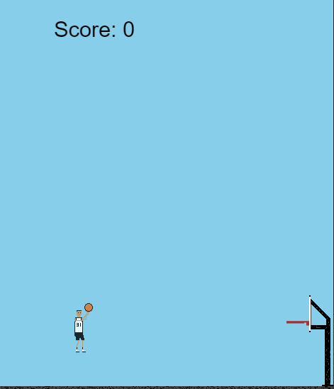

# vsball README

Basketball shootaround in VSCode.

## How to play

- Adjust extension window width to give you more space
- Move with A and D
- Jump with Space
- Shoot with holding Space
- Holding down space increases shot distance, peak power at the highest point of the jump
- Score

### Future updates

 - Improved pixel art and animations
 - Shot strength bar
 - Background art
 - Visual effects when on streak
 - Gameplay loop (moving rim, different targets)

## Contribute!

If you'd like to improve this game in some way, be it art, gameplay, or code optimization, feel free to do so by forking and submitting a pull request!

## Known Issues

- Slight movement lag upon landing sometimes
- Rim's left boundary is too thin

### 1.0.0

Initial release

**Enjoy!**
